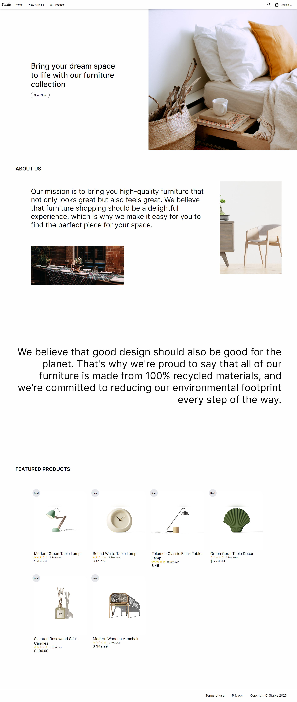
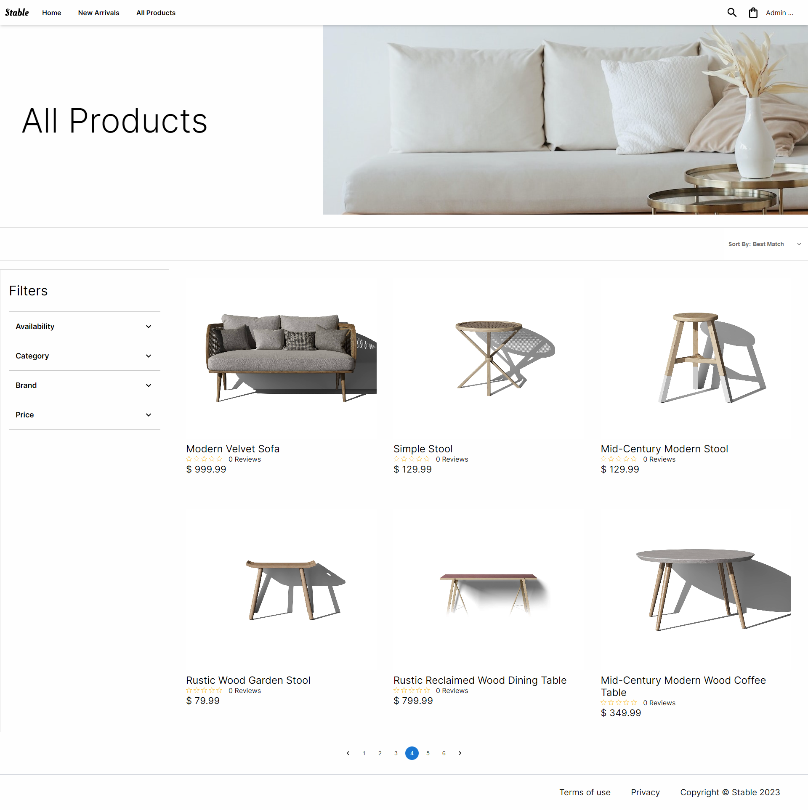
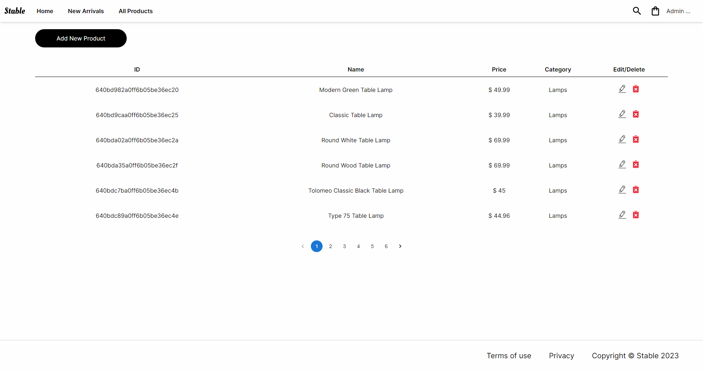

  
  <h1>Furniture eCommerce Web Apps</h1>

# Description

<!-- <a href="https://www.stable-store.com">Stable</a> is a React and Node.js based eCommerce Web App built using React, Express, Node.js, and MongoDB (MERN Stack) -->

# Live Site

<!-- https://www.stable-store.com -->

## Documentations

<a href="https://github.com/andyzhp234/stable-e-commerce-web/tree/main/documentations">Project Documentations</a>

# Screenshots

## Features

- Responsive layout
- User sign up, authentication, and authorization
- Display recommended products on home page
- Display new arrival products
- Display all products
- Sort products by price and rating
- Filter products by availability, category, brand, and price
- Search products by name, category, brand, and description
- Product detail page with image slider, ability to add product to shopping cart, and logged-in user/admin commenting and rating features
- Shopping cart with ability to change product quantity and delete products
- Admin panel with ability to view all registered users and admins, update user profiles, promote users to admin, and delete users
- Admin panel with ability to view all products, create new products, delete products, and update products
- Admin panel with ability to view all orders and mark orders as delivered
- User and admin profile updates
- Frontend and backend product pagination
- Loading backdrop to signal state change
- Dynamic head and meta tag changes using React-helmet
- Scroll animations for improved user experience
- Lazy load images for faster page loading time
- Loading skeletons for visual feedback during loading
- All product images stored in AWS S3 private bucket
- AWS CloudFront CDN to deliver content (images) faster and securely using HTTPS for S3 images

## Technologies

### Frontend

| Technologies                                                                                                      | Description                                                                                        |
| ----------------------------------------------------------------------------------------------------------------- | -------------------------------------------------------------------------------------------------- |
| [React.js](https://reactjs.org/)                                                                                  | Javascript Library for building user interfaces                                                    |
| [React Hooks](https://reactjs.org/docs/hooks-intro.html)                                                          | New addition in React 16.8 that let you use state and other React features without writing a class |
| [React Router v6.4.2](https://reactrouter.com/en/main)                                                            | Javascript standard library for routing in React                                                   |
| [React-helmet](https://www.npmjs.com/package/react-helmet)                                                        | Node.js packages that Manage all of your changes to the document head                              |
| [React-lazy-load-image-component](https://www.npmjs.com/package/react-lazy-load-image-component)                  | Node.js packages that lazy load images and other React components/elements.                        |
| [Axios](https://www.npmjs.com/package/axios)                                                                      | Node.js packages that implements the Promise API and used to make HTTP Requests                    |
| [Redux.js](https://redux.js.org/)                                                                                 | An open-source JavaScript library for managing and centralizing application state.                 |
| [Redux toolkit](https://redux-toolkit.js.org/)                                                                    | Redux official, opinionated, batteries-included toolset for efficient Redux development            |
| [Redux DevTools](https://chrome.google.com/webstore/detail/redux-devtools/lmhkpmbekcpmknklioeibfkpmmfibljd?hl=en) | Chrome extensions that helps for debugging Redux state                                             |
| [Sass](https://sass-lang.com/)                                                                                    | A preprocessor scripting language that is interpreted or compiled into Cascading Style Sheets.     |
| [Material UI](https://mui.com/)                                                                                   | A library of UI components that can use to build React applications                                |
| [Aos](https://www.npmjs.com/package/aos)                                                                          | Node.js packages that animate elements on your page as you scroll.                                 |

### Backend

| Technologies                                                   | Description                                                                                                                              |
| -------------------------------------------------------------- | ---------------------------------------------------------------------------------------------------------------------------------------- |
| [Node.js](https://nodejs.org/en/)                              | An open-source server environment                                                                                                        |
| [Express.js](https://expressjs.com/)                           | A back end web application framework for building RESTful APIs with Node.js                                                              |
| [Express-sslify](https://www.npmjs.com/package/express-sslify) | Node.js packages that enforces HTTPS connections on any incoming GET and HEAD requests                                                   |
| [Multer](https://www.npmjs.com/package/multer)                 | Node.js packages that handles multipart/form-data                                                                                        |
| [Dotenv](https://www.npmjs.com/package/dotenv)                 | Node.js packages that loads environment variables from .env file into process.env                                                        |
| [Cors](https://www.npmjs.com/package/cors)                     | Node.js packages that can be used to enable CORS with various options                                                                    |
| [Bcrypt.js](https://www.npmjs.com/package/bcryptjs)            | Node.js packages that enables storing of passwords as hashed passwords instead of plaintext                                              |
| [Mongoose.js](https://mongoosejs.com/docs/)                    | A Node.js-based Object Data Modeling (ODM) library for MongoDB                                                                           |
| [MongoDB Atlas](https://www.mongodb.com/atlas/database)        | A free cloud service to store MongoDB collections                                                                                        |
| [Stripe](https://stripe.com/)                                  | A suite of APIs powering online payment processing                                                                                       |
| [AWS S3 Storage Bucket](https://aws.amazon.com/s3/)            | AWS services that provides an object storage service offering industry-leading scalability, data availability, security, and performance |
| [AWS CloudFront CDN](https://aws.amazon.com/cloudfront/)       | AWS services that provides content delivery network (CDN) service                                                                        |
| [Railway.app](https://docs.railway.app/)                       | A Cloud Platform (PaaS) to deploy my Full stack Application                                                                              |
| [Google Domain](https://domains.google/)                       | A domain name registrar operated by Google.                                                                                              |

### Dev Tools

| Technologies       | Description                                                               |
| ------------------ | ------------------------------------------------------------------------- |
| Visual Studio Code | Code Editor                                                               |
| Postman            | API platform for developers to design, build, test and iterate their APIs |
| Lucidchart         | Sketch System Design flowchart diagrams                                   |

## Potential Improvements

- Refresh Token for better User experiences
- Use Elastic Search for product search
- User Authentication using Google / Facebook / OAuth
- Track Visitors & Analytics
- Improve SEO
- Cypress Test
- Jest Unit Test
