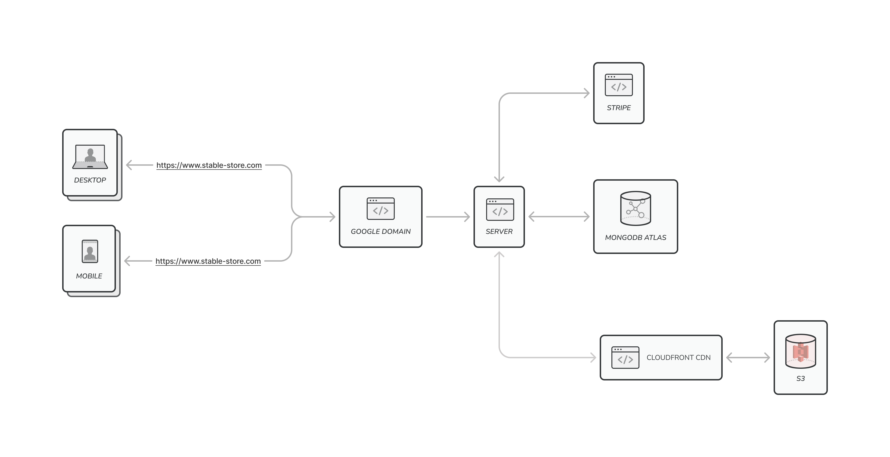
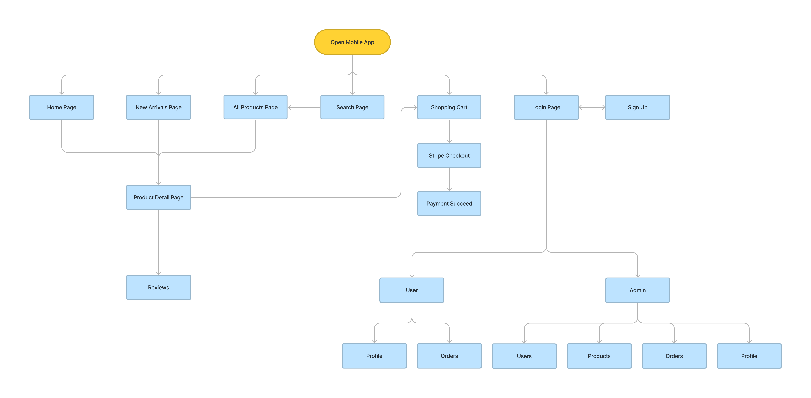

# Design Document

# Stable (furniture eCommerce)

Author: Haopeng Zeng

Date: 11/19/2022 (Updated)

# Table of Contents
1.  <a href="#overview">Overview</a>
2.  <a href="#project-specifications">Project Specifications</a>
    * <a href="#features"> Features </a>
    * <a href="#user-stories"> User Stories </a>
3.  <a href="#architecture-and-organization">Architecture and Organization</a>
    * <a href="#system-overview">System Overview </a>
    * <a href="#frontend-routes"> Frontend Routes </a>
    * <a href="#backend-rest-api-routes"> Backend REST API Routes </a>
    * <a href="#data-schemas"> Data Schemas </a>
    * <a href="#deployment"> Deployment </a>
    * <a href="#service-dependencies"> Service Dependencies </a>
4.  <a href="#design-considerations">Design Considerations</a>

# Overview

Stable is a online eCommerce web app that sells furnitures. This Web App is developed using React, Express, Node.js, and MongoDB.

I have started this project with the purpose of learning how to develope a Web App that solves real-life problems and fills a need in the business/enterprise space.

I have decided to develop an eCommerce site because I love shopping online, and I am also very interested in learning how to build a website that integrates checkout.

Unlike eCommerce websites like Amazon, eBay, or Walmart, which sells almost everything, this eCommerce web app specializes in selling furniture because I want to focus on a particular industry and make the website one of the best in that industry.

Due to copyright, there aren't many good product images you can find online for free; however, I was able to find many high-quality furniture product images at pexels.com and unsplash.com.

#### Why eCommerce?

eCommerce is a website that contains a bunch of listings for products. By building a eCommerce website I can learn more about SEO, content optimization, checkout optimization, and learn about how to track visitors, analytics.

# Project Specifications

## Features

- Responsive Layout
- User Sign up & User Authentication and Authorization
- Display Recommend Products on home page
- Display New Arrivals Products
- Display All Products
- Sort Products by Price and Rating
- Filter Products by Availability, Category, Brand, and Price
- Search Products by name, category, brand, and description
- Product Detail Page
  - Product image slider
  - Add product to shopping cart
  - Logged in User/Admin can leave comments with rating
  - Display all reviews
- Shopping Cart
  - User able to change product quantity within shopping cart page
  - User able to delete product
- Admin can view all registered users & admins
  - Admin is able to update users profile
  - Admin is able to promote a user to be admin
  - Admin is able to delete user
- Admin can view all products
  - Admin is able to create a new product
  - Admin is able to delete a product
  - Admin is able to update a product
- Admin can View All Orders
  - Admin can mark an order as delivered
- User/Admin can update their profile
- Frontend & Backend Paginations
- Loading backdrop to signal state change
- React-hemet to dynamically change head and meta tag
- Scroll animations for better user experiences
- Lazy Load Image to improve the page's loading time
- Loading skeletons
- All Product Images are store in AWS S3 Private Bucket
- AWS CloudFront CDN in front of AWS S3 to increase performance by delivering content (images) faster and HTTPs for S3 Images

## User Stories

| Title                                            | User Story Description                                                                                                                     | Priority  |
| ------------------------------------------------ | ------------------------------------------------------------------------------------------------------------------------------------------ | --------- |
| Good UI/UX design                                | As a visitor, I want the website to have a nice looking UI/UX design so that I can interact with the website with no trouble               | Must Have |
| User Authentication                              | As a CEO, I require user to login to use some features such as checkout and view orders.                                                   | Must Have |
| User Authentication using Google/Facebook/others | As a student, I wish to login to the website simply using 1 click google / facebook account                                                | Optional  |
| Home Page                                        | As a content manager, I wish there is a home page serving as both landing page and introduction to client about the company/website        | Must Have |
| New Arrivals                                     | As a content manager, I wish there is a page that display all the new arrivals products                                                    | Optional  |
| All Products Page                                | As a user, I wish to see all the products in a particular page.                                                                            | Must Have |
| Sorting Products                                 | As a user, I would like to sort the product base on price and ratings                                                                      | Must Have |
| Filter Products                                  | As a user, I would like to filter the product base on the category, brand, and price                                                       | Must Have |
| Search Products                                  | As a user, I would like to have the ability to search the product that I want to purchase/view                                             | Must Have |
| Search with auto complete                        | As a user, I wish the search functionalities comes with auto complete so that it can helps me find the product that I want faster.         | Optional  |
| Search using Elastic Search                      | As a software developer, I wish to include Elastic Search into the program so that the user can have faster search result.                 | Optional  |
| Product Detail Page                              | As a content manager, I wish there's a page that display more detailed informations about a product                                        | Must Have |
| Comments and Ratings                             | As a user, I wish to leave reviews to products that I have purchased so that other's who want to purchased the product can see my reviews. | Must Have |
| Shopping Cart Page                               | As a user, I wish the website have a shopping cart page where I can add all the products they want to purchase                             | Must Have |
| Secure Checkout                                  | As a user, I wish my payment checkout is processed securly and no payment informations are stored in website's database                    | Must Have |
| Scroll Animation                                 | As a content manager, I wish the website can have some scrolling effects to provide better user experience                                 | Optional  |
| Admin Users page                                 | As a web maintenance supervisor, I would like to see all the users so I can do CRUD operations on it                                       | Must Have |
| Admin Products page                              | As a web maintenance supervisor, I would like to see all the products so I can do CRUD operations on it                                    | Must Have |
| Admin Create Products                            | As a web maintenance supervisor, I would like to have the ability to create a product                                                      | Must Have |
| Admin Update Products                            | As a web maintenance supervisor, I would like to have the ability to update a product                                                      | Must Have |
| Admin Delete Products                            | As a web maintenance supervisor, I would like to have the ability to delete a product                                                      | Must Have |
| User Orders page                                 | As a user, I wish to see all the purchased that I have made in the past                                                                    | Must Have |
| Admin Orders page                                | As a web maintenance supervisor, I would like to see all the orders history                                                                | Must Have |
| Admin Update Orders                              | As a web maintenance supervisor, I would like to have the ability to update an order infomations                                           | Must Have |
| Admin/User Update Profiles                       | As a web maintenance supervisor, I would like to have the ability to update other people's profile                                         | Must Have |
| Domain                                           | As a CEO, I wish the website to have a professional looking domain to help branding my company.                                            | Must Have |

# Architecture and Organization

## System Overview

## Middleware

## Frontend Routes

| Public Endpoint | Description                                                                  |
| --------------- | ---------------------------------------------------------------------------- |
|                 | Landing page                                                                 |
| /newarrivals    | page that displays products that are new arrivals                            |
| /shop           | page that display all the products with the ability to sort and filter       |
| /product/:id    | page with detail information about a particular product (including comments) |
| /cart           | shopping cart page                                                           |
| /successPayment | payment success confirmation page when client complete the payment           |
| /login          | page where user can login to the website                                     |
| /register       | page where user can sign up an account and login to the website              |
| \*              | 404 Not Found Page                                                           |

 

| Private (login required) Endpoint | Description                                                            |
| --------------------------------- | ---------------------------------------------------------------------- |
| /profile                          | page that display informations about current user (name, email, etc..) |
| /orders                           | page that display all the orders made by current user                  |
| /order/:id                        | page that display detail information about an order from this user     |

 

| Admin (login as admin required) Endpoint | Description                                                 |
| ---------------------------------------- | ----------------------------------------------------------- |
| /admin/userlist                          | admin page that shows all registered user                   |
| /admin/editUser/:id                      | admin page that can edit a particular user                  |
| /admin/productlist/                      | admin page that shows all the products                      |
| /admin/editproduct/:id                   | admin page that can update an particular order              |
| /admin/createproduct/                    | admin page that can create an particular product            |
| /admin/orderlist/                        | admin page that display all the orders                      |
| /admin/orderdetails/:id                  | admin page that diplay detail page about a particular order |

## Backend REST API Routes

| Endpoint                       | Request type (GET, POST, etc.) | Description of the request/response                                                                                                                                                                              |
| ------------------------------ | ------------------------------ | ---------------------------------------------------------------------------------------------------------------------------------------------------------------------------------------------------------------- |
| stripe/create-checkout-session | POST                           | This endpoint needs all the id and the quantity of products the user wants to purchase, and return a stripe generated url to redirect the user to a web page created by stripe to complete the purchase securely |
| stripe/webhook                 | POST                           | This is the webhook that will listen from stripe. If a checkout.session.completed is triggered, the server will saved the order to the MongoDB database.                                                         |
| api/products                   | GET                            | This REST API will retrieve all products. It also accept sorting and filtering of a product, when these query are passed as parameter                                                                            |
| api/products/:id               | GET                            | This REST API will retrieve infomations about a particular product                                                                                                                                               |
| api/products/:id/reviews       | POST                           | Logged in users only. This REST API will add reviews to a particular product referenced by the id in the parameter                                                                                               |
| api/products/recommend         | GET                            | This REST API will retrieve all products that has attribute isRecommend equal to true                                                                                                                            |
| api/products/newarrivals       | GET                            | This REST API will retrieve all products that has attribute newArrivals equal to true                                                                                                                            |
| api/products                   | POST                           | Admin Only. This REST API will Create a Product with infomation sent in the body                                                                                                                                 |
| api/products/:id               | PUT                            | Admin Only. This REST API will Update the product referenced by the id parameter                                                                                                                                 |
| api/products/:id               | DELETE                         | Admin Only. This REST API will delete the product referenced by the id parameter                                                                                                                                 |
| api/users                      | POST                           | REST API to register a user                                                                                                                                                                                      |
| api/users/login                | POST                           | REST API to login a user. A 10 mins JWT Token will be returned back to user for authorization when logged in success                                                                                             |
| api/users/profile              | GET                            | Logged in user Only. This REST API will get the current user's user profile. User info is retrieved by decoding JWT Token and then database lookup.                                                              |
| api/users/profile              | PUT                            | Logged in user Only. This REST API will Update current user's profile                                                                                                                                            |
| api/users                      | GET                            | Admin only. This REST API will get All the users that is registered                                                                                                                                              |
| api/users/:id                  | GET                            | Admin only. This REST API will get information about particular user referenced by id parameter                                                                                                                  |
| api/users/:id                  | PUT                            | Admin only. This REST API will update information about particular user referenced by id parameter                                                                                                               |
| api/users/:id                  | DELETE                         | Admin only. This REST API will delete a particular user referenced by id parameter                                                                                                                               |
| api/orders/myorders            | GET                            | Logged in user only. This will get all the orders made by a user.                                                                                                                                                |
| api/orders/:id                 | GET                            | Logged in user only. This will get Infomations about a particular order                                                                                                                                          |
| api/orders                     | GET                            | Admin only. This will get All the orders (not restricted to a particular user)                                                                                                                                   |
| api/orders/:id                 | DELETE                         | Admin only. This will delete an order referenced by id parameter                                                                                                                                                 |
| api/orders/:id/deliver         | PUT                            | Admin only. This will update an order's delivery status to be delivered or on the way                                                                                                                            |

## Data Schemas

### User

| Column   | Type    | Description                              |
| -------- | ------- | ---------------------------------------- |
| \_id     | int     | Unique id serve as primary key of a user |
| name     | String  | The full name of a user                  |
| email    | String  | email for a user account                 |
| password | String  | hashed password for a user account       |
| isAdmin  | Boolean | True if a user is Admin                  |

### Product

| Column       | Type     | Description                                           |
| ------------ | -------- | ----------------------------------------------------- |
| \_id         | int      | Unique id serve as primary key of a product           |
| user         | ObjectID | Unique user id of the user who created this product   |
| name         | String   | Name of the product                                   |
| images       | Array    | Array of strings that contains the image urls         |
| brand        | String   | Brand of the product                                  |
| category     | String   | Category of the product                               |
| description  | String   | Description of the product                            |
| reivews      | Array    | Array of reviews for this product                     |
| rating       | int      | Rating of this product                                |
| numReviews   | int      | Number of reviews of this product                     |
| price        | int      | Price of the product                                  |
| countInStock | int      | Number of this product in stock                       |
| isRecommend  | Boolean  | True if this product shows up in recommend section    |
| isNewArrival | Boolean  | True if this product shows up in new Arrivals section |

### Review

| Column  | Type     | Description                             |
| ------- | -------- | --------------------------------------- |
| name    | String   | The title of the review                 |
| rating  | Float    | The rating for the product              |
| comment | String   | The comment content                     |
| user    | ObjectID | Unique ID of user who wrote this review |

### Order

| Column          | Type    | Description                                                                          |
| --------------- | ------- | ------------------------------------------------------------------------------------ |
| \_id            | int     | Unique id serve as primary key of an order                                           |
| user            | String  | userid of the user who made this order                                               |
| orderItems      | Array   | Array of objects about the product the user purchased                                |
| shippingAddress | Object  | Object containing infomations about the shipping address                             |
| paymentMethod   | String  | The payment method that is used to complete the purchase                             |
| taxPrice        | Number  | The total amount of tax collected during the payment                                 |
| shippingPrice   | Number  | The total amount of shipping price collected during the payment                      |
| subTotalPrice   | Number  | the final amount being charged for all the products only (No Tax & shipping & etc..) |
| totalPrice      | Number  | The final amount being charged                                                       |
| isPaid          | Boolean | True if this order is paid                                                           |
| paidAt          | Date    | Date that the payment is completed                                                   |
| isDelivered     | Boolean | True if this order is delivered                                                      |
| deliveredAt     | Date    | Date that the order is delivered                                                     |
| orderPaymentID  | int     | Unique ID for stripe reference                                                       |
| timestamps      | Date    | Unique ID of user who wrote this review                                              |

## Deployment

Server is currently deployed to Heroku but I am thinking about deploying it to AWS in the future.

MongoDB Atlas for database.

AWS S3 for images hosting.

Domain Registered to Google Domain

## Service Dependencies

| Dependency name    | Why it is needed                                                        |
| ------------------ | ----------------------------------------------------------------------- |
| Stripe             | Payment Gateway                                                         |
| MongoDB Atlas      | Free Cloud Service to store MongoDB collections                         |
| AWS S3             | AWS services to store images (Background Images, Icons, Product images) |
| AWS CloudFront CDN | AWS services                                                            |
| Domain             | Google Domain                                                           |

# Design Considerations

## Design Decisions

#### Authentication: JWT vs Session (cookies)

#### Database: Relational (MySQL, PostgreSQL) vs Non-relational (MongoDB)

#### Redux VS React Context

#### Redux Vs Redux Toolkits

## Challenges Face

- Learning how to use CSS Preprocessor (Sass).
- Learning how to use payment gateway (Stripe).
- Learning how to use AWS S3 & CloudFront & IAM.

## Interesting and noteworthy bugs encoutered during the development

- Heroku H18
- Stripe API secret key
