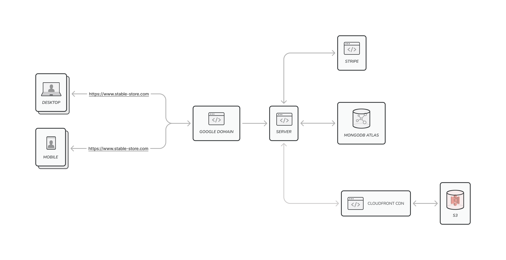

# Design Document

# Stable (furniture eCommerce)

Author: Haopeng Zeng

Date: 3/12/2022 (Updated)

# Table of Contents

1.  <a href="#overview">Overview</a>
2.  <a href="#project-specifications">Project Specifications</a>
    - <a href="#features"> Features </a>
    - <a href="#user-stories"> User Stories </a>
3.  <a href="#architecture-and-organization">Architecture and Organization</a>
    - <a href="#system-overview">System Overview </a>
    - <a href="#middleware"> Middleware </a>
    - <a href="#frontend-routes"> Frontend Routes </a>
    - <a href="#backend-rest-api-routes"> Backend REST API Routes </a>
    - <a href="#data-schemas"> Data Schemas </a>
    - <a href="#deployment"> Deployment </a>
    - <a href="#service-dependencies"> Service Dependencies </a>
4.  <a href="#design-considerations">Design Considerations</a>

# Overview

Stable is an eCommerce web application that offers furniture for sale online. The app was created using React, Express, Node.js, and MongoDB. My motivation for embarking on this project was to gain hands-on experience in developing a web application that solves real-world problems and meets the needs of businesses.

#### Why eCommerce?

I believe that building an eCommerce website presents a great opportunity to enhance my frontend skills. Creating an attractive and user-friendly website that encourages users to make purchases is an in-demand skill set. Additionally, building an eCommerce website enables me to learn valuable skills such as SEO optimization.

During the project, I also gained knowledge on how to integrate online payment systems using API such as Stripe. I also became aware of how image sizes can significantly impact the user experience of the website. Using large image sizes can take up more bandwidth, making it slower for users to download the page and negatively impacting the overall performance of the website.

# Project Specifications

## Features

- Responsive layout
- User sign up, authentication, and authorization
- Display recommended products on home page
- Display new arrival products
- Display all products
- Sort products by price and rating
- Filter products by availability, category, brand, and price
- Search products by name, category, brand, and description
- Product detail page with image slider, ability to add product to shopping cart, and logged-in user/admin commenting and rating features
- Shopping cart with ability to change product quantity and delete products
- Admin panel with ability to view all registered users and admins, update user profiles, promote users to admin, and delete users
- Admin panel with ability to view all products, create new products, delete products, and update products
- Admin panel with ability to view all orders and mark orders as delivered
- User and admin profile updates
- Frontend and backend product pagination
- Loading backdrop to signal state change
- Dynamic head and meta tag changes using React-helmet
- Scroll animations for improved user experience
- Lazy load images for faster page loading time
- Loading skeletons for visual feedback during loading
- All product images stored in AWS S3 private bucket
- AWS CloudFront CDN to deliver content (images) faster and securely using HTTPS for S3 images

## User Stories

| Title                         | User Story Description                                                                                                                                       | Priority  |
| ----------------------------- | ------------------------------------------------------------------------------------------------------------------------------------------------------------ | --------- |
| Intuitive User Interface      | As a website visitor, I want the eCommerce website to have an intuitive and user-friendly interface so that I can browse and shop easily.                    | Must Have |
| User Authentication           | As the website owner, I require users to log in to access certain features, such as the shopping cart and order history.                                     | Must Have |
| Social Login                  | As a website user, I want the option to log in using my Google or Facebook account to simplify the login process.                                            | Optional  |
| Home Page                     | As a content manager, I want a homepage that introduces the website's brand and purpose and showcases featured products to engage users.                     | Must Have |
| New Arrivals Section          | As a content manager, I want a dedicated page that displays all the new products added to the website to keep users informed about new arrivals.             | Optional  |
| Product Listing Page          | As a website user, I want to see all the products available for purchase on a single page with filtering and sorting options to simplify the product search. | Must Have |
| Sorting and Filtering         | As a website user, I want the ability to sort products based on price, rating, and other criteria to find the products I'm interested in quickly.            | Must Have |
| Product Details Page          | As a content manager, I want a product detail page that displays all relevant information about a product, including images, descriptions, and pricing.      | Must Have |
| Ratings and Reviews           | As a website user, I want the ability to rate and review products to help other users make informed purchasing decisions.                                    | Must Have |
| Shopping Cart                 | As a website user, I want a shopping cart page where I can add and remove products and view the total cost of my purchase.                                   | Must Have |
| Secure Checkout               | As a website user, I want a secure checkout process that encrypts my payment information and prevents unauthorized access to my data.                        | Must Have |
| Search Functionality          | As a website user, I want the ability to search for products using keywords or product names to quickly find the products I'm looking for.                   | Must Have |
| Auto-complete Search          | As a website user, I want the search bar to have an auto-complete function to suggest relevant products and streamline my search.                            | Optional  |
| Elastic Search Integration    | As a website developer, I want to integrate Elastic Search into the website to improve search speed and accuracy for users.                                  | Optional  |
| Scroll Effects                | As a content manager, I want to use scroll effects to enhance the user experience and make the website more engaging.                                        | Optional  |
| User Management               | As the website owner, I want an admin user page to manage user accounts, including adding, updating, and deleting users.                                     | Must Have |
| Product Management            | As the website owner, I want an admin product page to manage product listings, including adding, updating, and deleting products.                            | Must Have |
| Order Management              | As the website owner, I want an admin order page to manage customer orders, including updating order information and tracking order status.                  | Must Have |
| User Order History            | As a website user, I want to view my order history, including order status and shipping information, to keep track of my past purchases.                     | Must Have |
| User Account Management       | As a website user, I want the ability to update my personal information, including my shipping address and payment details.                                  | Must have |
| Admin/User Profile Management | As the website owner, I want the ability to manage user profiles, including adding, updating, and deleting user information.                                 | Must Have |
| Professional Domain Name      | As the website owner, I want a professional domain name that reflects the brand and increases the website's credibility.                                     | Must Have |

# Architecture and Organization

## System Overview

## Middleware

## Frontend Routes

| Public Endpoint | Description                                                                  |
| --------------- | ---------------------------------------------------------------------------- |
|                 | Landing page                                                                 |
| /newarrivals    | page that displays products that are new arrivals                            |
| /shop           | page that display all the products with the ability to sort and filter       |
| /product/:id    | page with detail information about a particular product (including comments) |
| /cart           | shopping cart page                                                           |
| /successPayment | payment success confirmation page when client complete the payment           |
| /login          | page where user can login to the website                                     |
| /register       | page where user can sign up an account and login to the website              |
| \*              | 404 Not Found Page                                                           |

 

| Private (login required) Endpoint | Description                                                            |
| --------------------------------- | ---------------------------------------------------------------------- |
| /profile                          | page that display informations about current user (name, email, etc..) |
| /orders                           | page that display all the orders made by current user                  |
| /order/:id                        | page that display detail information about an order from this user     |

 

| Admin (login as admin required) Endpoint | Description                                                 |
| ---------------------------------------- | ----------------------------------------------------------- |
| /admin/userlist                          | admin page that shows all registered user                   |
| /admin/editUser/:id                      | admin page that can edit a particular user                  |
| /admin/productlist/                      | admin page that shows all the products                      |
| /admin/editproduct/:id                   | admin page that can update an particular order              |
| /admin/createproduct/                    | admin page that can create an particular product            |
| /admin/orderlist/                        | admin page that display all the orders                      |
| /admin/orderdetails/:id                  | admin page that diplay detail page about a particular order |

## Backend REST API Routes

| Endpoint                       | Request type (GET, POST, etc.) | Description of the request/response                                                                                                                                                                              |
| ------------------------------ | ------------------------------ | ---------------------------------------------------------------------------------------------------------------------------------------------------------------------------------------------------------------- |
| stripe/create-checkout-session | POST                           | This endpoint needs all the id and the quantity of products the user wants to purchase, and return a stripe generated url to redirect the user to a web page created by stripe to complete the purchase securely |
| stripe/webhook                 | POST                           | This is the webhook that will listen from stripe. If a checkout.session.completed is triggered, the server will saved the order to the MongoDB database.                                                         |
| api/products                   | GET                            | This REST API will retrieve all products. It also accept sorting and filtering of a product, when these query are passed as parameter                                                                            |
| api/products/:id               | GET                            | This REST API will retrieve infomations about a particular product                                                                                                                                               |
| api/products/:id/reviews       | POST                           | Logged in users only. This REST API will add reviews to a particular product referenced by the id in the parameter                                                                                               |
| api/products/recommend         | GET                            | This REST API will retrieve all products that has attribute isRecommend equal to true                                                                                                                            |
| api/products/newarrivals       | GET                            | This REST API will retrieve all products that has attribute newArrivals equal to true                                                                                                                            |
| api/products                   | POST                           | Admin Only. This REST API will Create a Product with infomation sent in the body                                                                                                                                 |
| api/products/:id               | PUT                            | Admin Only. This REST API will Update the product referenced by the id parameter                                                                                                                                 |
| api/products/:id               | DELETE                         | Admin Only. This REST API will delete the product referenced by the id parameter                                                                                                                                 |
| api/users                      | POST                           | REST API to register a user                                                                                                                                                                                      |
| api/users/login                | POST                           | REST API to login a user. A 10 mins JWT Token will be returned back to user for authorization when logged in success                                                                                             |
| api/users/profile              | GET                            | Logged in user Only. This REST API will get the current user's user profile. User info is retrieved by decoding JWT Token and then database lookup.                                                              |
| api/users/profile              | PUT                            | Logged in user Only. This REST API will Update current user's profile                                                                                                                                            |
| api/users                      | GET                            | Admin only. This REST API will get All the users that is registered                                                                                                                                              |
| api/users/:id                  | GET                            | Admin only. This REST API will get information about particular user referenced by id parameter                                                                                                                  |
| api/users/:id                  | PUT                            | Admin only. This REST API will update information about particular user referenced by id parameter                                                                                                               |
| api/users/:id                  | DELETE                         | Admin only. This REST API will delete a particular user referenced by id parameter                                                                                                                               |
| api/orders/myorders            | GET                            | Logged in user only. This will get all the orders made by a user.                                                                                                                                                |
| api/orders/:id                 | GET                            | Logged in user only. This will get Infomations about a particular order                                                                                                                                          |
| api/orders                     | GET                            | Admin only. This will get All the orders (not restricted to a particular user)                                                                                                                                   |
| api/orders/:id                 | DELETE                         | Admin only. This will delete an order referenced by id parameter                                                                                                                                                 |
| api/orders/:id/deliver         | PUT                            | Admin only. This will update an order's delivery status to be delivered or on the way                                                                                                                            |

## Data Schemas

### User

| Column   | Type    | Description                              |
| -------- | ------- | ---------------------------------------- |
| \_id     | int     | Unique id serve as primary key of a user |
| name     | String  | The full name of a user                  |
| email    | String  | email for a user account                 |
| password | String  | hashed password for a user account       |
| isAdmin  | Boolean | True if a user is Admin                  |

### Product

| Column       | Type     | Description                                           |
| ------------ | -------- | ----------------------------------------------------- |
| \_id         | int      | Unique id serve as primary key of a product           |
| user         | ObjectID | Unique user id of the user who created this product   |
| name         | String   | Name of the product                                   |
| images       | Array    | Array of strings that contains the image urls         |
| brand        | String   | Brand of the product                                  |
| category     | String   | Category of the product                               |
| description  | String   | Description of the product                            |
| reivews      | Array    | Array of reviews for this product                     |
| rating       | int      | Rating of this product                                |
| numReviews   | int      | Number of reviews of this product                     |
| price        | int      | Price of the product                                  |
| countInStock | int      | Number of this product in stock                       |
| isRecommend  | Boolean  | True if this product shows up in recommend section    |
| isNewArrival | Boolean  | True if this product shows up in new Arrivals section |

### Review

| Column  | Type     | Description                             |
| ------- | -------- | --------------------------------------- |
| name    | String   | The title of the review                 |
| rating  | Float    | The rating for the product              |
| comment | String   | The comment content                     |
| user    | ObjectID | Unique ID of user who wrote this review |

### Order

| Column          | Type    | Description                                                                          |
| --------------- | ------- | ------------------------------------------------------------------------------------ |
| \_id            | int     | Unique id serve as primary key of an order                                           |
| user            | String  | userid of the user who made this order                                               |
| orderItems      | Array   | Array of objects about the product the user purchased                                |
| shippingAddress | Object  | Object containing infomations about the shipping address                             |
| paymentMethod   | String  | The payment method that is used to complete the purchase                             |
| taxPrice        | Number  | The total amount of tax collected during the payment                                 |
| shippingPrice   | Number  | The total amount of shipping price collected during the payment                      |
| subTotalPrice   | Number  | the final amount being charged for all the products only (No Tax & shipping & etc..) |
| totalPrice      | Number  | The final amount being charged                                                       |
| isPaid          | Boolean | True if this order is paid                                                           |
| paidAt          | Date    | Date that the payment is completed                                                   |
| isDelivered     | Boolean | True if this order is delivered                                                      |
| deliveredAt     | Date    | Date that the order is delivered                                                     |
| orderPaymentID  | int     | Unique ID for stripe reference                                                       |
| timestamps      | Date    | Unique ID of user who wrote this review                                              |

## Deployment

Backend server is currently deployed to Railway.apps

MongoDB Atlas for MongoDB database.

AWS S3 for images hosting.

Domain Registered to Google Domain

## Service Dependencies

| Dependency name    | Why it is needed                                                        |
| ------------------ | ----------------------------------------------------------------------- |
| Stripe             | Payment Gateway                                                         |
| MongoDB Atlas      | Free Cloud Service to store MongoDB collections                         |
| AWS S3             | AWS services to store images (Background Images, Icons, Product images) |
| AWS CloudFront CDN | AWS services                                                            |
| Domain             | Google Domain                                                           |
